## DEVOPS TOOLING WEBSITE SOLUTION

## STEP 1 - PREPARE NFS SERVER

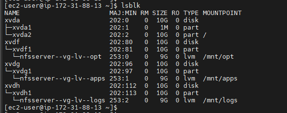
---

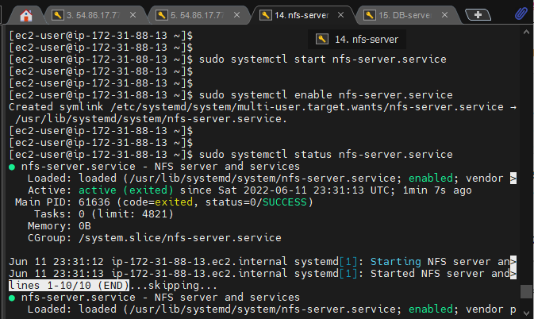
---

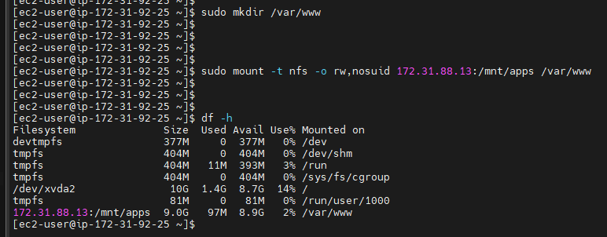
---

---

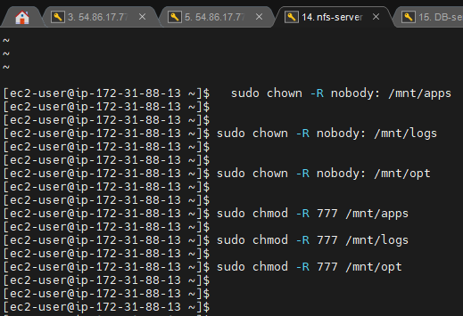
---

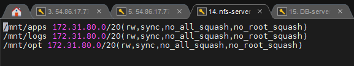
---

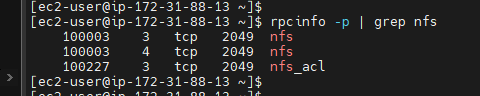
---

## STEP 2 - CONFIGURE THE DATABASE SERVER

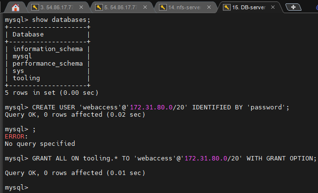
---

## STEP 3 - PREPARE THE WEB SERVERS

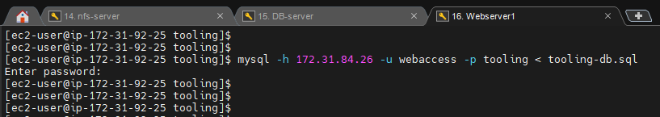
---

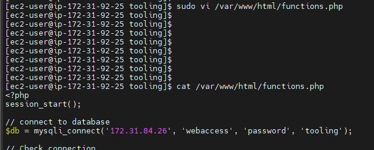
---

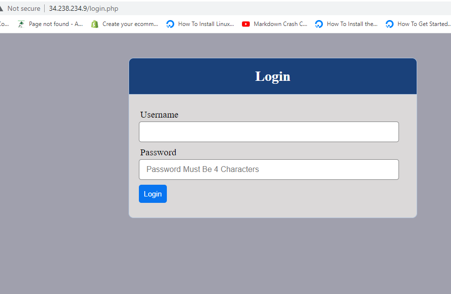
---

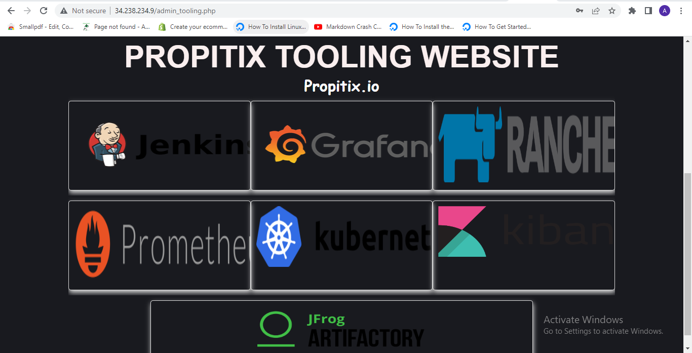
---