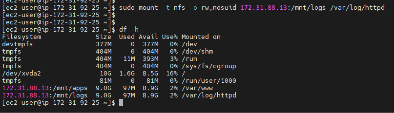

## DEVOPS TOOLING WEBSITE SOLUTION

## STEP 1 - PREPARE NFS SERVER

---

---

---

---

---

---

---

## STEP 2 - CONFIGURE THE DATABASE SERVER

---

## STEP 3 - PREPARE THE WEB SERVERS

---

---

---

---